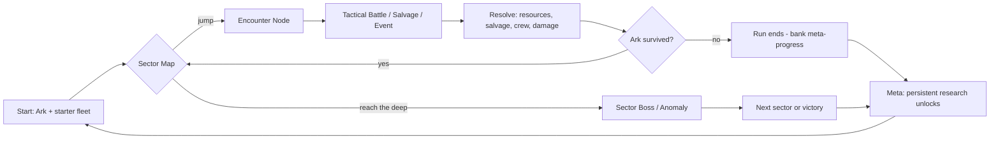
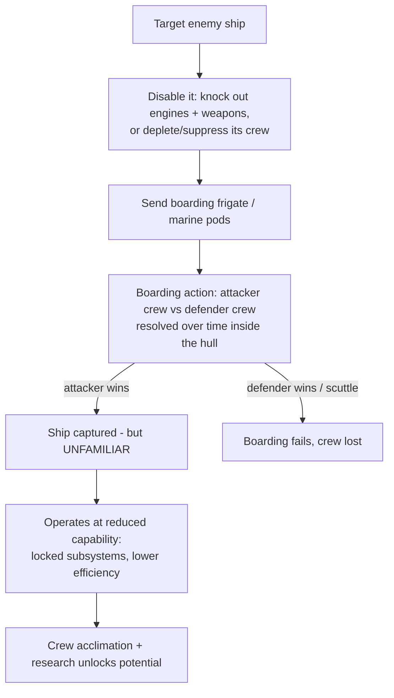
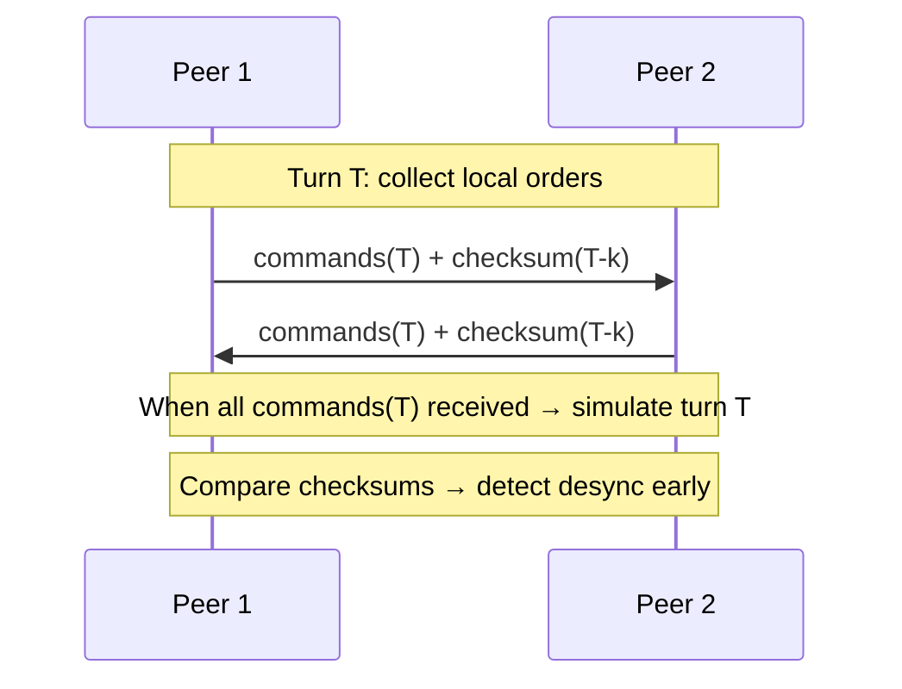
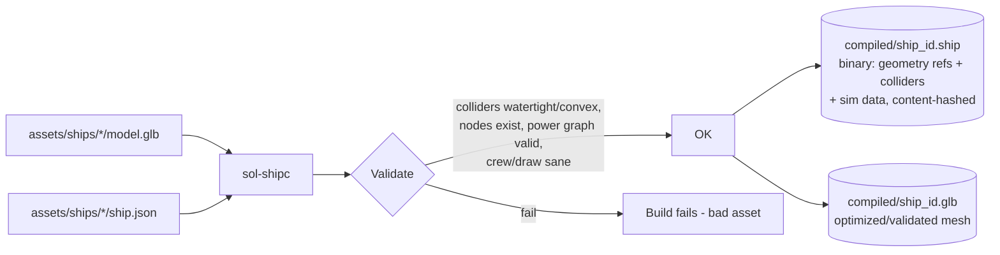

# Sea of Lost Souls - Design Document

> A 3D, Homeworld-style space RTS with roguelike campaign structure, built in
> Rust + wgpu, targeting the **web browser first** and desktop second.
>
> You command not a hero unit but a *fleet intelligence*. The camera is your
> body. The mothership is your heart. The void is full of derelicts and the
> crews who died aboard them - salvage them, capture them, and learn their
> secrets before the sea swallows you too.

This is a living design document. It captures intent, the technical plan, and
the open questions. It is the source of truth for *what we are building and
why*. Implementation details that change often live in code and `CLAUDE.md`.

---

## Table of Contents

1. [Vision & Pillars](#1-vision--pillars)
2. [Game Overview](#2-game-overview)
3. [Core Loop & Roguelike Campaign](#3-core-loop--roguelike-campaign)
4. [Fleet, Ships & Scarcity](#4-fleet-ships--scarcity)
5. [Crew, Capture & Research](#5-crew-capture--research)
6. [Ship Simulation Model](#6-ship-simulation-model)
7. [The Procedural Universe](#7-the-procedural-universe)
8. [Reactive Environments](#8-reactive-environments)
9. [Camera & Controls](#9-camera--controls)
10. [UI / HUD](#10-ui--hud)
11. [Rendering Architecture (wgpu)](#11-rendering-architecture-wgpu)
12. [Technical Architecture](#12-technical-architecture)
13. [Multiplayer (Peer-to-Peer)](#13-multiplayer-peer-to-peer)
14. [Asset Strategy: Static vs Procedural](#14-asset-strategy-static-vs-procedural)
15. [The Ship Asset Pipeline](#15-the-ship-asset-pipeline)
16. [Web-Based Ship Editor](#16-web-based-ship-editor)
17. [Build & Deployment Pipeline](#17-build--deployment-pipeline)
18. [Repository Structure](#18-repository-structure)
19. [Vertical Slice (Milestone 0)](#19-vertical-slice-milestone-0)
20. [Roadmap](#20-roadmap)
21. [Risks & Open Questions](#21-risks--open-questions)
22. [Glossary](#22-glossary)

---

## 1. Vision & Pillars

**Sea of Lost Souls** is a tactical, fully-3D space RTS in the spirit of
*Homeworld*: a small, persistent fleet maneuvering through a vast, dark,
volumetric battlespace where position, orientation, and momentum matter. We
wrap that classic feel in a **roguelike campaign**: scarce resources,
permadeath of the run, and meta-progression earned by mastering the ships and
technologies you pry from the dead.

### Design Pillars

| Pillar | What it means | What it rules out |
|---|---|---|
| **The fleet is precious** | Few ships, expensive to build, painful to lose. Every hull matters. | Disposable spam armies; build-order races. |
| **Space is a 3D place, not a plane** | Full volumetric movement, the famous Homeworld move-disk, attacks from above/below. | 2D-on-a-plane RTS with a fixed top-down camera. |
| **You command, you don't pilot** | The player is fleet intelligence; the camera is its sensorium. Orders, not twitch. | Direct flight-sim piloting of a single ship. |
| **The universe pushes back** | Environments are simulated and reactive - they respond to your tactics and become hazards or tools. | Static skyboxes and inert "decoration" hazards. |
| **Salvage over manufacture** | Capturing and mastering enemy ships is the smart economy; building is the desperate one. | Pure factory economies with infinite reinforcements. |
| **Web-first, no install** | It runs in a browser tab at a URL, on every commit. | Desktop-only, heavyweight installers as the primary path. |

### Theme

The title is literal. The battlespace is a graveyard - drifting derelicts,
ghost-quiet hulls adrift in nebulas, crews lost to the dark. Your fleet sails
this sea, and the central tension is *moral and mechanical entanglement with
the dead*: you survive by taking what they left behind, but every captured ship
carries an unfamiliar crew, alien systems, and risk.

---

## 2. Game Overview

- **Genre:** Real-time tactics / RTS, single- and multiplayer, roguelike
  campaign meta-structure.
- **Perspective:** Free 3D command camera (Homeworld "sensors sphere" model).
- **Scale:** Squadron-to-small-fleet. Tens of ships on screen, not thousands.
  Scarcity is a feature, and it keeps the per-ship simulation rich and the
  netcode tractable.
- **Platforms:** Web browser (WebGPU, WebGL2 fallback) **first**; native
  desktop (Windows/Linux/macOS via the same wgpu codebase) **second**.
- **Engine:** Custom Rust engine on **wgpu**, borrowing mature ecosystem crates
  for non-rendering concerns (ECS, math, physics queries, GUI, networking).
  See [§12](#12-technical-architecture).

### The "Camera as Character" conceit

In *Homeworld* the player is a disembodied fleet command bound to a persistent
mothership. We make that literal and mechanical:

- The **camera is the player's presence** in the world - a sensor point of view
  that exists *in* the simulation, not floating above it.
- What the camera/fleet can *see* is governed by the [sensors model](#6-ship-simulation-model):
  fog of war, nebula occlusion, active vs. passive detection. The camera is not
  omniscient.
- The **mothership (the "Ark")** is the anchor of a run. It is where your
  command intelligence "lives," where ships are built, where research happens,
  and where captured crews are interned and re-trained. **Lose the Ark and the
  run ends.** Building ships exposes it (see [§4](#4-fleet-ships--scarcity)).

This conceit lets us unify three things players usually treat separately -
*camera, fog of war, and the run's win/lose condition* - into one coherent
fiction.

---

## 3. Core Loop & Roguelike Campaign

A **run** is a voyage across a sector of the Sea, structured as a branching
node map (think *FTL* / *Slay the Spire* topology, but each node is a 3D
tactical encounter).



### Within a run (scarce, tense, permadeath)

- **Resources** are scarce and carried between encounters: *Salvage* (raw
  matter for repair/build), *Power Cells* (deployable energy reserves),
  *Crew* (the rarest resource - people don't respawn), and *Intel* (unlocks
  research within the run).
- **Permadeath** at the run level: destroyed ships and dead crew are gone for
  the run. The Ark's destruction ends the run.
- **Choices compound:** repair vs. build vs. capture vs. flee. Every encounter
  leaves you weaker or richer, and the map forces you deeper.

### Between runs (meta-progression)

- A **persistent research tree** ([§5](#5-crew-capture--research)) unlocks
  across runs: new starting loadouts, the *ability* to operate certain captured
  alien hull classes, crew doctrines, Ark modules.
- Meta-progression is about **capability and knowledge, not raw power** - you
  unlock *understanding* of exotic tech, not stat boosts. This keeps each run a
  test of tactics, not a grind wall.

---

## 4. Fleet, Ships & Scarcity

Ships are the heart of the fantasy and the economy. They are **few, costly, and
individually simulated** ([§6](#6-ship-simulation-model)).

### Ship classes (initial taxonomy)

| Class | Role | Notes |
|---|---|---|
| **Ark (Mothership)** | Command, production, research, crew berthing | One per run. Its loss = game over. Slow, well-defended, but vulnerable while building. |
| **Strike craft** (fighters/bombers) | Fast harassment, anti-strike-craft | Cheap-ish, crewed by few, attritable but still not free. |
| **Frigates** | Workhorse line combatants; specialized variants (ion, missile, support, **boarding**) | The backbone. Boarding frigates enable capture. |
| **Capital ships** | Heavy hitters, rich subsystem trees | Expensive, slow, devastating; prime capture targets. |
| **Utility** (collectors, sensors, repair) | Economy & support | Salvage collection, forward sensor pickets. |

### Building is the *desperate* economy

Building at the Ark is intentionally painful:

- **Costly** in Salvage *and* Crew (a new hull needs people to run it).
- **Slow** - construction takes real encounter time; you can't build mid-fight
  and expect it to arrive.
- **Dangerous** - an active construction bay forces the Ark to lower defenses /
  divert reactor power (an explicit power trade-off in the [energy model](#6-ship-simulation-model)),
  making it **vulnerable**. Enemies that detect a building Ark will press the
  advantage.

### Capturing is the *smart* economy

The cheaper path to a bigger fleet is **taking** ships
([§5](#5-crew-capture--research)) - but it is risky, situational, and gated by
research and crew acclimation. This is the central economic tension: *manufacture
exposes your heart; salvage entangles you with the dead.*

---

## 5. Crew, Capture & Research

### Crew

Crew are the **rarest resource** and a first-class simulated entity per ship:

- Ships require a minimum crew to operate subsystems; below it, systems run
  degraded or offline.
- Crew take **casualties** from hull breaches, life-support failure, fire, and
  boarding actions ([§6](#6-ship-simulation-model)).
- Crew carry **proficiencies** (e.g., *Human Reactor Eng.*, *Vaered Ion
  Doctrine*). Proficiency with a ship's tech determines how much of its
  potential you can unlock.

**Crew are a logistics roster, split into two categories:**

- **Ship operations** crew run reactors, subsystems, and damage control; the
  proficiency model above applies to them.
- **Pilots** fly strike craft (fighters, bombers). Pilots gain **experience**
  and improve over a campaign; when killed they are replaced only slowly, either
  by recruiting with **prestige** earned through noble deeds, or by
  **retraining** operations crew into pilots (cheaper, but sloppier and less
  effective).

Crew are **allocated, not spent**. There is rarely enough to fully staff every
hull, so the player constantly triages: pulling crew off one ship to operate
another **degrades** the donor's system efficiency, repair rate, and overall
performance. Between missions, **low morale** can make crews leave entirely.
Because crew are earned mainly through prestige (noble deeds across the
campaign), they are the tightest constraint in the fleet economy.

### Capturing a ship



A freshly captured alien ship is **not** immediately a full asset:

- **Unfamiliarity penalty:** unknown subsystems are locked or run at reduced
  efficiency; exotic weapons may be unusable until understood.
- **Acclimation:** assigned crew gain proficiency over time aboard the ship,
  and through **research** ([Intel](#3-core-loop--roguelike-campaign) spent at
  the Ark).
- **Mastery:** with enough proficiency + the right research-tree branch
  unlocked, the ship reaches full potential - sometimes exceeding anything you
  could build.

### Research tree (branches)

Research spans **within-run** (Intel unlocks tactical capability this run) and
**meta** (persistent across runs). Proposed branches:

- **Xenotech mastery** - per-civilization branches (each captured faction's
  hull classes, weapons, and subsystems). Unlocks the *ability* to fully operate
  their ships.
- **Reactor & Power** - better energy throughput, capacitor tech, conduit
  resilience.
- **Doctrine** - crew training: boarding, damage-control, gunnery, sensors.
- **Ark modules** - production speed, additional bays, defensive upgrades,
  research throughput.
- **Survey** - better sensors, anomaly analysis, safer navigation of hazards.

> Design rule: meta-progression unlocks **knowledge and access**, not flat
> stat inflation. The fun is "now I can crew a Vaered dreadnought," not "+10%
> damage."

---

## 6. Ship Simulation Model

Every non-trivial ship is a **simulated machine**, not a bag of stats. This is
where the depth lives. The model has four coupled layers: **power**,
**subsystems**, **structure/hitboxes**, and **crew**.

### 6.1 Reactor & the power grid

A ship is a small **power network**:

```
 [Reactor] --conduit--> [Bus] --+--> [Capacitor] --> [Weapons]
                                |--> [Engines]
                                |--> [Shields]
                                |--> [Sensors]
                                |--> [Life Support]
```

- The **reactor** produces power (a rate, MW) each simulation tick.
- Power flows along **conduits** (edges with capacity) to a bus and out to
  **subsystems** (nodes that consume power).
- **Capacitors** buffer energy for bursty loads (weapon volleys).
- The player sets **allocation priorities** across subsystems - the core
  tactical economy of a single ship (evoking bridge-sim games like *FTL* /
  Star Trek bridge management, layered onto an RTS). Overdrive engines for a
  flanking run and your shields sag; charge weapons for an alpha strike and
  sensors dim.
- **Damage rewires the network:** a hit that severs a conduit or kills the
  reactor cuts power downstream. This makes *where* you hit a ship matter.

> The power grid is a small graph solved each tick (clamp flows to conduit
> capacity, distribute by priority, drain/charge capacitors). It is fully
> deterministic and lives in the simulation crate (`sol-sim`) - critical for
> [lockstep multiplayer](#13-multiplayer-peer-to-peer).

### 6.2 Subsystems

Each subsystem is a component placed at a **hardpoint** (a position + collider
inside the hull) authored in the [ship editor](#16-web-based-ship-editor).

| Subsystem | Function | Power behavior | If damaged/destroyed |
|---|---|---|---|
| **Reactor** | Generates power | Source | Power output falls; destruction can chain-explode. |
| **Engines** | Thrust + maneuver | Heavy draw; scales with throttle | Sluggish or dead in the water; can't flee. |
| **Shields** | Regenerating barrier (faceted; see below) | Heavy draw; regen scales with power | Facings drop; hull exposed. |
| **Weapons** (per hardpoint) | Damage output | Draw from capacitor per shot | That mount goes silent. |
| **Sensors** | Detection range/resolution | Moderate; active mode draws more | Blind; fog closes in around the ship. |
| **Life Support** | Keeps crew alive | Light but critical | Crew attrition begins; clock to casualties. |
| **Bridge / Command** | Crew control & coordination | Light | Ship loses orders/coordination; easier to capture. |

### 6.3 Structure, hitboxes & positional damage

- Each ship has an **outer hull collider** (convex hull or compound shape)
  authored in the editor, used for hit detection and selection.
- Subsystems have **internal positions + colliders**. A shot that defeats
  shields and penetrates the hull can damage a *specific* subsystem based on
  impact location and penetration - enabling targeted tactics (kill their
  engines to prevent escape; kill weapons to safely board).
- **Shields are faceted/directional** (e.g., 6 facings). Flanking and
  positioning matter: hit the weak facing.
- **Hull integrity** is tracked per **section**; sections breach, venting
  atmosphere (life-support / crew consequences).

> Collision uses `parry3d` shape queries (raycasts for weapons, overlap tests
> for proximity/boarding) over a custom broad-phase (spatial grid / BVH sized
> to the encounter). See [§12](#12-technical-architecture).

### 6.4 Crew (inside the machine)

- Crew occupy the ship and **operate subsystems**; minimum crew thresholds gate
  function.
- **Casualties** from breaches, fire, life-support loss, and **boarding**
  (attacker vs. defender resolution inside the hull over time).
- **Damage control:** crew can be tasked to repair subsystems, fight fires, or
  repel boarders - a within-ship micro-economy of attention.

### 6.5 Sensors, emissions & fog of war

- **Active sensors:** long range, high resolution - but **broadcast your
  position** (emissions detectable by enemies). 
- **Passive sensors:** stealthy, shorter range, lower resolution.
- The environment modulates sensing: **nebulas occlude**, **ion storms jam**,
  **pulsars wash out** passive sensors with periodic sweeps. This ties the
  sensor model directly to the [reactive universe](#8-reactive-environments).
- Fog of war is the player's *actual* knowledge - consistent with the
  [camera-as-character](#the-camera-as-character-conceit) conceit.

### 6.6 Flight & movement model

Homeworld ships are **not** free-floating Newtonian bodies and **not**
rigid-body physics props - they fly with an *arcade* model: a top speed, finite
acceleration, a turn rate, and banking into turns. They arrive and stop; they
don't drift forever. We adopt the same, scaled by **mass class**:

- **State:** position, orientation (quaternion), linear & angular velocity.
- **Steering:** an *arrive* behavior toward the order target (decelerate into
  the point), constrained by per-class max speed / acceleration / turn-rate.
  Strike craft are nimble; capital ships are sluggish and wide-turning.
- **Formation flocking:** formation slots define desired offsets; ships seek
  their slot with separation so they hold shape without jostling.
- **Banking & roll** are *visual* (render-only) flourishes on the deterministic
  motion; they never feed back into the sim.

Movement integration runs in `sol-sim` at the **fixed timestep**
(deterministic); the renderer interpolates between ticks for smoothness.

### 6.7 Collision model (and the Homeworld lineage)

Observably, Homeworld ships **mostly avoid** each other and only
**occasionally collide** - and when they do, they don't ricochet like billiard
balls. Across the series the behavior matured from HW1's looser
avoidance/overlap (capital ships could foul each other, and ramming dealt
damage) to HW2's tighter formation-flying and avoidance. We want that *feel*:
graceful avoidance first, gentle (and damaging) contact second - never bouncy
rigid-body chaos.

Our approach is **avoidance-first kinematic motion with soft contact response**:

1. **Avoidance (primary):** a *separation* steering term keeps ships spaced;
   local avoidance steers around obstacles (other hulls, asteroids) along the
   path. Most "collisions" are prevented before they happen - this is what sells
   the Homeworld look.
2. **Broad phase:** a spatial structure (uniform grid or BVH, e.g. parry's
   `Qbvh`) sized to the encounter finds candidate overlaps cheaply.
3. **Narrow phase:** `parry3d` shape queries against the authored convex
   hulls/compounds ([§6.3](#63-structure-hitboxes--positional-damage)) produce
   contacts.
4. **Soft response (no restitution):** on real contact we apply a **gentle
   separation impulse + velocity damping**, scaled by **mass** - fighters get
   shoved aside, capital ships barely budge, and nothing bounces. Relative
   momentum at impact deals **ram damage** (and can be a deliberate tactic).
5. **Continuous collision detection (CCD):** fast ships (and all projectiles)
   are swept along their path each tick so they can't tunnel through thin hulls
   - essential for both fairness and determinism.

> **Library choice: `parry3d`, not `rapier3d`.** We want collision *queries* and
> a custom kinematic response, not a dynamics solver. `rapier` (forces,
> restitution, joints) would fight us by making things bounce and by adding
> solver nondeterminism. `parry3d` gives us raycasts, shape-casts, contact
> generation, convex decomposition, and the BVH - exactly what a space RTS needs
> - while we own the motion and response rules. (Tumbling *wreckage/debris*, if
> we add it, is a **render-only, non-deterministic** flourish that may use a
> throwaway dynamics pass which never touches `sol-sim`.)

### 6.8 Ballistics & projectiles

Per the brief, **every bullet is physical but deterministic** - no abstract
"dice-roll" hit chances on ballistic weapons.

- **Projectiles are entities** in `sol-sim` with position + velocity, integrated
  at the fixed timestep (semi-implicit Euler). They have travel time, can be
  dodged, and can miss.
- **Firing solution:** when a mount fires at a moving target it computes a
  deterministic **lead/intercept** (solve for the interception point given
  projectile speed and target velocity). Slow guns must lead fast ships; fast
  ships can juke slow rounds - emergent, skill-expressive combat.
- **Hit detection = swept query (CCD):** each tick, ray/shape-cast the
  projectile's segment of travel against candidate colliders via `parry3d`. No
  tunneling, frame-rate-independent, deterministic.
- **Weapon archetypes:**
  - *Kinetic / pulse* - discrete projectiles as above.
  - *Beam* - an instantaneous ray (still a deterministic `parry3d` raycast);
    continuous power draw.
  - *Missile / torpedo* - a **guided** projectile: deterministic
    pursuit/proportional-navigation steering toward the target, with fuel/turn
    limits (so it can be outmaneuvered or flared).
- **Impact resolution (deterministic, positional):** at the hit point we
  resolve, in order - **shield facing** → **hull section** → **subsystem** (by
  which internal collider the penetrating shot struck;
  [§6.3](#63-structure-hitboxes--positional-damage)). This is what makes "shoot
  their engines" real and ties weapons to the
  [capture loop](#5-crew-capture--research).
- **Gravity / fields:** projectile integration reads the deterministic
  environmental fields ([§8](#8-reactive-environments)) - gravity wells curve
  trajectories; magnetar/ion fields perturb or disrupt - all on the coarse CPU
  sim so every peer agrees.

### 6.9 Determinism in the physics sim (non-negotiable for multiplayer)

[Lockstep multiplayer](#13-multiplayer-peer-to-peer) requires that movement,
collision, and ballistics produce **bit-identical** results on every peer -
including **wasm vs. native**. The physics layer is the hardest part of that
promise, so we design for it from day one:

- **Fixed timestep**, fixed integration scheme, no wall-clock anywhere in
  `sol-sim`.
- **Deterministic iteration order:** ships, contacts, and projectiles are
  processed in a **canonical order** (stable entity ids / sorted contact keys),
  so resolution never depends on hash-map or thread ordering.
- **Controlled floating point:** no fast-math/FMA contraction surprises; route
  transcendentals (intercept math, trig) through the **`libm`** crate so
  `sin/cos/sqrt` match across platforms; prefer scalar paths over autovectorized
  ones where results could differ.
- **Fixed-point escape hatch:** if cross-platform `f32` proves too divergent for
  the most sensitive quantities (positions/velocities), move *those* to
  fixed-point while keeping the rest in float.
- **Seeded RNG only:** any scatter/spread is drawn from the sim's deterministic
  PRNG, never the OS.
- **Desync detection:** the sim state (all bodies + projectiles) is
  **checksummed every K ticks**; peers compare and halt+report on divergence
  ([§13](#13-multiplayer-peer-to-peer)).
- **Determinism test harness (build it early):** replay an identical command
  stream on native and on wasm, compare per-tick checksums, and fail CI if they
  drift. Catching divergence the day it is introduced is the only sane way to
  keep lockstep alive.

> This is *why* `parry3d` is used purely for queries and we own
> integration/response: it keeps every floating-point operation that affects
> gameplay inside `sol-sim`, where we can control it.

---

## 7. The Procedural Universe

The battlespace is **procedurally generated** per encounter (seeded for
reproducibility and multiplayer sync). It must feel like a *place* - vast,
volumetric, and dangerous - not a backdrop. (Ships are the exception: they are
**static, authored assets** - see [§14](#14-asset-strategy-static-vs-procedural).)

### Environment elements

| Element | Generation approach | Gameplay role |
|---|---|---|
| **Voxel nebulas** | Sparse volumetric density field (3D noise / brick grid), raymarched | Sensor occlusion, concealment, fuel for ion storms; some are flammable/charged. |
| **Dust clouds** | Lighter-density volumetric fields | Soft cover, visual depth, mild sensor scatter. |
| **3D asteroids** | Procedural meshes (displaced icospheres / marching cubes on a voxel field), instanced fields | Cover, collision hazards, Salvage sources, line-of-sight blockers. |
| **Planets** | Procedural sphere shaders (noise terrain, atmosphere scattering) | Backdrops, gravity, mission anchors; rarely entered. |
| **Gravity wells** | Scalar/vector field over the encounter | Bend trajectories, slingshots, traps; affect missile/strike-craft paths. |
| **Pulsars** | Rotating volumetric beam + periodic EM sweep | Timed sensor/comms disruption; rhythmic hazard windows. |
| **Supernovae** | Expanding volumetric shockwave + radiation field | Map-changing event; a moving wall of death/opportunity. |
| **Magnetars** | Strong EM field viz | Disrupt shields/electronics; weapon and sensor penalties. |
| **Black holes** | Screen-space gravitational lensing + accretion volumetrics + strong gravity well | Terrain you route around; instant loss if crossed; tactical anchor. |

### Determinism & seeding

- Each encounter is generated from a **seed** (derived from the run seed + node
  id). Same seed ⇒ same universe on every peer - required for
  [lockstep multiplayer](#13-multiplayer-peer-to-peer) and for reproducible
  bug reports.
- **Two representations** of the procedural world:
  - **Gameplay/deterministic** - coarse fields and collider geometry on the CPU
    in `sol-sim` (gravity, sensor occlusion, hazard intensity). Drives
    simulation and must be identical across peers.
  - **Visual** - high-resolution volumetrics on the GPU in `sol-render`,
    derived from the same seed but allowed to be device-dependent (it never
    feeds back into gameplay). See [§11](#11-rendering-architecture-wgpu).

---

## 8. Reactive Environments

The universe is not just procedural - it is **simulated and reactive**. Player
and AI tactics perturb environmental fields, which feed back into both visuals
and gameplay. This is a headline feature.

### The canonical example: the ion storm

1. A nebula region carries a baseline **ion charge** field.
2. Firing **energy weapons** (and certain subsystem events) **injects charge**
   into the local field.
3. Past a threshold the region **ignites into an ion storm**: heightened, more
   dangerous conditions - sensor jamming, shield disruption, arc damage,
   chaotic lighting.
4. The storm is now a **shared hazard and a weapon**: bait an enemy into a
   nebula, provoke the storm with your own fire, and let it savage their
   shields while you fight on kinetics.

### How it works (architecture)

- Environmental fields (ion charge, radiation, heat, gravity) are **coarse 3D
  grids** in `sol-sim`, advanced each tick by simple, **deterministic** update
  rules (diffusion, decay, thresholds) plus **injections** from gameplay events.
- Gameplay reads these fields (e.g., sensor range *= occlusion factor; shields
  take arc damage in active storm cells).
- `sol-render` reads the *same* field state to drive **visual intensity**
  (denser, angrier volumetrics; lightning; color shifts) at high resolution.
- Because the gameplay field is coarse and deterministic, **all peers see the
  same storm evolve** from the same actions - reactivity is multiplayer-safe.

> Generalization: any "anomaly" can expose an injectable/decaying field with
> threshold behaviors. Supernova shockwaves, magnetar surges, and pulsar sweeps
> all reuse this field-simulation substrate. Build it once, reuse everywhere.

---

## 9. Camera & Controls

The control scheme is the soul of the Homeworld feel. Two systems define it:
the **command camera** and **3D order issuing** (the move-disk), plus classic
**box selection**.

### 9.1 The command camera (Homeworld "sensors sphere")

**How Homeworld actually does it (reference).** The camera is a *focus-orbit*
camera - never a free-fly/FPS camera. Its state is `(focus point, distance,
yaw, pitch)` with **world-up preserved** (the horizon never rolls) and pitch
clamped. Everything orbits a focus:

- **Focus** is re-anchored with `F` (focus on selection), `Home` (focus on the
  Mothership/flagship), cycled with `Page Up`/`Page Down` (next/previous focus),
  and `Num 0` (last combat event). Once focused, the camera *tracks* that target
  as it moves.
- **Orbit / tumble:** hold the **right mouse button and drag** to rotate around
  the focus; hold **`Alt`** to lock onto and orbit a specific entity under the
  cursor (the usual way you fly the view around a battle).
- **Zoom & camera height:** the **mouse wheel** dollies in/out. Zooming fully
  out opens the **Sensors Manager** - a flattened, abstracted tactical sphere of
  the whole battlespace where you can still select and issue orders.
- **Pan** the focus with the arrow keys (forward/back/left/right) and
  `Insert`/`Delete` (up/down).

> Exact bindings differ across Homeworld 1, 2, and Remastered and are all
> rebindable; the *model* - focus-orbit, sensors view, focus cycling - is the
> constant, and that is what we implement.

**Our model** adopts this directly:

- State = focus point + distance + yaw + pitch; world-up locked; pitch clamped
  just shy of the poles to avoid gimbal flip.
- Orbit (RMB-drag, `Alt` to re-lock), zoom (wheel), pan focus (keys/edge),
  focus-on-selection (`F`), focus-on-Ark (`Home`), cycle focus.
- Far zoom → **sensors view** (icons/vectors, readable at fleet scale; orders
  still issuable).
- Momentum-eased and framerate-independent - the camera *is* the player, so it
  must feel like an extension of intent. The focus tracks moving selections.

### 9.2 Issuing 3D orders - the move-disk

Moving in true 3D with a 2D mouse is *the* Homeworld problem, solved by the
**movement disc**. The exact Homeworld flow:

1. With ships selected, press **`M`** (Move) - a horizontal **disc** (the "blue
   circle") appears, centered on the selection at its current altitude.
2. **Move the mouse** to slide the destination across the disc - this sets the
   **X/Z** position (and how far).
3. To set **altitude (Y)**: **hold `Shift` and drag the mouse up/down** - a
   vertical guide line lifts the destination above/below the disc plane.
4. **Click** to confirm. Ships path to the 3D point, preserving formation.

A plain **right-click** also issues a context order - *move* to empty space,
*attack* on an enemy - but the `M`-disc is the precise 3D tool. We implement
both: RMB context-orders for speed, and the `M`-disc (`Shift`+vertical for
altitude) for deliberate positioning, drawing a clear gizmo (disc, altitude
pole, destination ghost, formation preview).

Supporting order tools (Homeworld defaults shown):
- **Attack-move** (`Ctrl+A`), **Waypoints** (`W`), **Stop** (`S`),
  **Guard** (`G`), **Dock** (`D`), **Hyperspace/jump** (`J`).
- **Formation & facing** on arrival; **formations** (Delta, Broad, Wall, X,
  Claw, Sphere, …).
- **Tactics stance:** *Evasive / Neutral / Aggressive* - changes how units
  engage and reposition.
- **Power presets** (our addition): per-selection energy allocation ("engines
  hot," "weapons free," "rig for silent running").

### 9.3 Selection

- **Single select:** left-click a ship.
- **Band-box (marquee):** left-click-drag a screen rectangle; selects friendlies
  whose footprint intersects it (frustum test against hull colliders for 3D
  correctness).
- **Select all of type:** double-click a ship → all of that type on screen.
- **Control / hotkey groups:** `Ctrl+1…9` to bind, `1…9` to recall (double-tap
  to focus the group).
- **Modifiers:** `Shift` add, `Alt`/`Ctrl` subtract (configurable).
- **From the sensors view:** selection and orders work at fleet scale too.

### 9.4 Attack & combat orders

- **Attack:** select, right-click an enemy (or the `Attack` command). Multiple
  groups can **focus-fire** one target.
- **Attack-move** (`Ctrl+A`): advance to a point, engaging anything hostile en
  route.
- **Guard / escort** a ship or volume; **patrol** via waypoints.
- **Subsystem targeting (Homeworld 2):** against capital ships you can target
  specific **subsystems** - engines, turrets, production, sensors. This maps
  directly onto our
  [positional-damage model](#63-structure-hitboxes--positional-damage): kill
  engines to prevent escape, kill weapons to move in safely and **board**
  ([§5](#5-crew-capture--research)).
- **Capture order:** send boarding frigates at a sufficiently disabled target
  ([§5](#5-crew-capture--research)).

### 9.5 Input bindings (initial)

| Action | Default | Notes |
|---|---|---|
| Orbit camera | RMB drag (`Alt` = lock to entity) | Yaw/pitch around focus |
| Zoom / camera height | Mouse wheel | Far out → sensors view |
| Pan focus | Arrows / edge-scroll; `Ins`/`Del` up-down | Move focus point |
| Focus on selection | `F` | Re-anchor + track |
| Focus on Ark | `Home` | The mothership |
| Cycle focus | `PgUp`/`PgDn`; `Num0` last event | |
| Select / band-box | LMB / LMB-drag | Click / marquee |
| Select all of type | Double-click | On-screen |
| Move (disc) | `M`, then mouse; `Shift`+vertical = altitude | The 3D move tool |
| Context order | RMB | Move on empty / attack on enemy |
| Attack-move | `Ctrl+A` | |
| Waypoints / Stop / Guard / Dock / Jump | `W` / `S` / `G` / `D` / `J` | |
| Control group set/recall | `Ctrl+N` / `N` | |
| Tactics stance | hotkey cycle | Evasive/Neutral/Aggressive |
| Power preset | `1`-`4` on hotbar | Per-selection allocation |

> Bindings are data-driven and fully rebindable; defaults mirror Homeworld
> Remastered where applicable. Controllers are out of scope for the slice, but
> the input layer must not hard-code mouse assumptions, and **touch is a required
> test harness** (see [§9.6](#96-mobile-test-harness-input-parity)).

### 9.6 Mobile test harness (input parity)

The target experience is desktop (mouse + keyboard), but **every gameplay
feature must also be exercisable in a phone/tablet browser**, because mobile
testing massively shortens iteration. Mobile is a **test harness, not a polished
touch UX**: keep it minimal but always functional.

- A lightweight **DOM control overlay** (HTML buttons/menus outside the wgpu
  canvas) plus basic **touch input** (tap to select/move) drive the *same*
  wasm-exported commands as the desktop path; there is no parallel gameplay
  logic.
- The move-disk altitude gesture stays desktop-only for now; mobile substitutes
  a simple altitude control.
- On-device debugging uses **eruda** (a mobile DevTools console) injected in the
  game's `index.html`; it loads only on touch devices, or on any device when the
  URL carries `?eruda`.
- Gameplay on touch is **landscape-only**: in portrait the game shows a button
  that, on tap (the required user gesture), enters fullscreen and locks the
  orientation to landscape (best-effort; some browsers, e.g. iOS, ignore the
  lock).
- **Rule:** never ship a gameplay feature that can only be tested on desktop.

---

## 10. UI / HUD

The brief calls for a **simple, immediate-mode GUI** layered on wgpu. We use
**`egui`** via **`egui-wgpu`** (+ `egui-winit`):

- Immediate mode → trivial to iterate, no retained-widget bookkeeping, excellent
  for tools and debug overlays.
- First-class **web + desktop** support, renders in our wgpu pass.
- Same toolkit powers in-game HUD **and** debug/dev panels (entity inspector,
  field visualizers, netcode stats).

### HUD surfaces (slice → full)

- **Selection panel:** selected ships, health, **power-allocation bars**, crew,
  subsystem status.
- **Command hotbar:** orders + power presets.
- **Tactical overlay:** velocity vectors, move-disk gizmo, sensor ranges,
  hazard fields (toggleable), threat indicators.
- **Sensors/minimap (3D-aware):** a readable representation of the volumetric
  battlespace and contacts.
- **Run/Resource bar:** Salvage, Power Cells, Crew, Intel; Ark status &
  build queue.
- **Dev overlays (debug builds):** ECS inspector, field heatmaps, frame/sim
  timing, network desync checksums.

> 2D in-world labels (ship names, health pips, order lines) are drawn as part of
> the tactical overlay, projected from world to screen. Keep the HUD legible at
> both close and sensors-view zoom.

---

## 11. Rendering Architecture (wgpu)

**Web-first** dictates the rendering plan. We target **WebGPU** as the primary
backend (Chrome/Edge stable; Firefox and Safari shipping support through
2024-2025) with a **reduced-quality WebGL2 fallback** that `wgpu` provides
transparently for raster, plus graceful feature-detection for the parts that
need compute.

### Backend tiers

| Tier | Backend | Volumetrics / fields | Notes |
|---|---|---|---|
| **High** | WebGPU (web), Vulkan/Metal/DX12 (native) | Compute-driven volumetrics & field updates, full effects | Primary target. |
| **Fallback** | WebGL2 | Fragment-shader raymarch at low res, simpler procedural visuals, **no compute** (visual field updates approximated; gameplay fields always on CPU) | Keep it playable, not pretty. |

### Render graph (high tier)

```
1. Depth pre-pass            (opaque ships, asteroids, planets)
2. Opaque G-buffer / forward (PBR ships [static GLB], asteroids, planets)
3. Volumetric pass           (half-res raymarch: nebulas, dust, anomaly fx;
                              reads density/field textures; temporal reproject)
4. Transparent & particles   (engine trails, weapon fx, debris)
5. Composite + post          (volumetric upscale/composite, bloom,
                              black-hole lensing, tonemap, color grade)
6. UI overlay                (egui + tactical overlay)
```

### Key techniques

- **Volumetric nebulas/dust:** raymarch a sparse density field (3D textures /
  brick grid). **Half-resolution** volumetric buffer + **temporal
  reprojection** + bilateral upscale to stay within web GPU budgets. LOD by
  distance and by camera zoom (sensors view simplifies).
- **Procedural meshes (asteroids):** generated on the GPU/CPU at encounter load,
  **instanced** across asteroid fields. (Asteroids are a permitted procedural
  exception - see [§14](#14-asset-strategy-static-vs-procedural).)
- **Planets:** sphere shaders - noise terrain, atmospheric scattering - runtime.
- **Anomalies:** black-hole **lensing** as a screen-space post effect over an
  accretion volumetric; pulsar beams and supernova shells as animated
  volumetrics driven by the [reactive fields](#8-reactive-environments).
- **Ships:** static **GLB** meshes, **PBR** materials with **statically baked
  textures** (hard project rule, [§14](#14-asset-strategy-static-vs-procedural)),
  GPU instancing for same-class hulls.
- **Determinism boundary:** rendering never feeds gameplay. Visual field
  resolution/timing may differ per device; gameplay reads only the coarse
  deterministic CPU fields.

> Performance budget is a first-class constraint. The volumetric pass is the
> biggest risk on web; it gets an explicit, tunable budget (resolution scale,
> step count, max active anomaly fields) exposed in dev settings.

---

## 12. Technical Architecture

### Language & crate stack

| Concern | Choice | Why |
|---|---|---|
| Language | **Rust** | Brief; safety + wasm story. |
| GPU | **wgpu** | Brief; one API for WebGPU + native, WebGL2 fallback. |
| Windowing/input | **winit** | De-facto standard; web + desktop. |
| Math | **glam** | SIMD, the gamedev standard. |
| ECS | **bevy_ecs** (standalone) | Scales to the rich subsystem/crew/field sim; systems + scheduling + change detection. (`hecs` is a lighter alternative if we want minimalism.) |
| GUI | **egui** + `egui-wgpu` + `egui-winit` | Immediate mode; web + desktop; HUD + tools. |
| Collision | **parry3d** | Raycasts, shape queries, convex hulls; no forced rigid-body sim. |
| Net transport | **matchbox** (WebRTC) | True browser P2P; native too. See [§13](#13-multiplayer-peer-to-peer). |
| Serialization | **serde** (+ `bincode`/`rkyv` for compiled runtime data, JSON for authoring) | Authoring is JSON (editor interop); runtime is fast binary. |
| Determinism helpers | `libm` for fixed math; fixed-timestep loop | Cross-platform determinism for lockstep. |
| wasm build | **trunk** | Bundles wasm + assets + `index.html`; great DX. |

> **Why custom-wgpu and not Bevy (the engine)?** The brief asks for wgpu
> specifically, and reactive volumetric rendering is a core pillar we want to
> own. So we hand-roll the **renderer** while borrowing mature crates for
> everything that isn't rendering (including `bevy_ecs` as a *library*). If the
> renderer becomes a sink, full Bevy is the documented fallback - but that is a
> deliberate, later decision, not the default.

### Crate layout (Cargo workspace)

```
sol-app      → entry point (native bin + wasm); winit + wgpu + egui wiring,
               game states, input, glue. The only crate that knows about both
               render and sim.
sol-sim      → DETERMINISTIC simulation: ECS world, fixed-timestep tick,
               power grid, subsystems, crew, collision queries, env fields,
               procedural-gameplay generation. NO rendering, NO wall-clock,
               NO OS RNG. This crate is the multiplayer source of truth.
sol-render   → wgpu renderer: render graph, volumetrics, instancing, post,
               procedural VISUALS. Reads sim state; never writes it.
sol-procgen  → seeded generators shared by sim (gameplay geometry/fields) and
               render (visual detail). Deterministic core + visual elaboration.
sol-net      → P2P lockstep over matchbox: command collection, turn scheduling,
               input delay, desync detection (state checksums).
sol-assets   → runtime loading of COMPILED ship data (.ship binary) + GLB
               meshes/colliders; asset registry.
sol-shipc    → CLI tool: compiles authored ship JSON + GLB into runtime assets,
               validates colliders & sim data. Runs in CI. See [§15].
```

Dependency direction: `sol-app` → {`sol-sim`, `sol-render`, `sol-net`,
`sol-assets`}; `sol-render`/`sol-sim` → `sol-procgen`; `sol-sim` depends on
**nothing graphical**. Keeping `sol-sim` pure is what makes lockstep and tests
possible.

### Simulation loop

- **Fixed timestep** (e.g., 30 Hz sim) decoupled from render framerate;
  render **interpolates** between the last two sim states for smoothness.
- All gameplay randomness flows from a **seeded, deterministic RNG** owned by
  `sol-sim`. No `SystemTime`, no thread-RNG, no unordered iteration in the sim.
- This loop is identical in single-player and multiplayer; multiplayer simply
  feeds it [synchronized commands](#13-multiplayer-peer-to-peer).

---

## 13. Multiplayer (Peer-to-Peer)

> **Status: draft / forward-looking.** Single-player and the
> [vertical slice](#19-vertical-slice-milestone-0) come first. But because
> determinism is *architectural*, we design the sim for it from day one - retro-
> fitting determinism later is brutal.

### Model: deterministic lockstep

RTS with few units → the classic, proven approach is **deterministic lockstep**
(the *Age of Empires* model), not state replication or per-entity rollback:

- Every peer runs the **identical** `sol-sim` on the **same seed**.
- Peers exchange only **commands** (orders), not world state - tiny bandwidth,
  scales with players not entities.
- Commands are scheduled **N turns in the future** (input delay, e.g.,
  100-250 ms of "turns") so all peers have every command before simulating that
  turn. The sim advances a turn only when all peers' commands for it are in.



### Transport: WebRTC via `matchbox`

- **`matchbox`** gives browser-to-browser **WebRTC data channels** (and works
  natively), with a lightweight **signaling server** (`matchbox_server`) used
  only to introduce peers - gameplay traffic is peer-to-peer.
- Unreliable-ordered channels for command turns (with our own small
  retransmit/ack for the turn protocol); reliable channel for lobby/handshake.
- For small skirmishes, **`ggrs`** (GGPO-style rollback) over matchbox is a
  documented alternative; but for RTS-scale entity counts we default to
  **delay-based lockstep**, which avoids re-simulating thousands of entities.

### The hard part: determinism

Lockstep lives or dies on **bit-identical simulation across machines** -
including **wasm vs. native** and different GPUs/CPUs:

- **Fixed timestep**, fixed iteration order (stable entity ordering), seeded RNG.
- **Controlled floating point:** avoid fast-math; route transcendentals through
  the **`libm`** crate so `sin/cos/sqrt` match across platforms; beware FMA
  contraction differences. Consider **fixed-point** for the most sensitive
  quantities (positions/velocities) if f32 proves too divergent.
- **No nondeterminism in `sol-sim`:** no wall-clock, no hash-map iteration order,
  no floating-point from the renderer crossing back in.
- **Desync detection:** each peer hashes a **state checksum** every K turns and
  exchanges it; mismatch → halt, report the turn, and dump state for diffing.
- **Recovery:** on desync, fall back to a one-time **state resync** from an
  agreed peer (designated by lowest peer-id) - a pragmatic safety net for a P2P
  game without a server.

### Security caveats (be honest)

- **P2P lockstep has no authority**, so it is vulnerable to **"maphack"-style**
  information cheats (a modified client can ignore fog of war) - a known,
  accepted RTS trade-off. We mitigate *state-altering* cheats because divergence
  trips the checksum, but we cannot fully prevent passive information cheats
  without a server.
- A later **optional dedicated/host-authoritative mode** is the answer for
  ranked/competitive play; the lockstep core is the LAN/friends/co-op default.

---

## 14. Asset Strategy: Static vs Procedural

This is a **hard project rule** (mirrored in `CLAUDE.md`):

> **All game models and their textures MUST be statically generated
> (authored + compiled ahead of time).**
> **Exceptions - generated procedurally at runtime - are: the space
> environment (nebulas, dust, anomalies, fields), planets, and (optionally)
> asteroids.**

| Asset | Static (authored + compiled) | Procedural (runtime) |
|---|---|---|
| Ships & ship textures | ✅ **required** | ❌ never |
| Ship subsystems / hardpoints / colliders | ✅ **required** | ❌ |
| Stations / structures (treated as ships) | ✅ | ❌ |
| Nebulas, dust clouds, env fields | ❌ | ✅ |
| Planets | ❌ | ✅ |
| Asteroids | allowed either way | ✅ (preferred) |
| Anomalies (pulsar/supernova/black hole/magnetar) | ❌ | ✅ |

**Why this split:**
- **Ships are gameplay-critical and net-synced.** Their geometry, colliders,
  hardpoints, and sim data must be *identical, validated, and versioned* across
  all peers and builds. Authored+compiled assets give us that guarantee; runtime
  procedural ship generation would threaten determinism and balance.
- **Environments benefit from variety and reactivity.** Procedural nebulas and
  anomalies give endless, seedable, *reactive* battlespaces - and they don't
  need to be bit-identical *visually*, only their coarse gameplay fields do
  (which are generated deterministically from the seed in `sol-sim`).

---

## 15. The Ship Asset Pipeline

Ships are **authored** (in the [web editor](#16-web-based-ship-editor)) and
**compiled** (by `sol-shipc`) into runtime assets. The pipeline is the bridge
between the human-friendly editor and the deterministic engine.

### Model format decision: **GLB** (not OBJ)

We use **glTF 2.0 binary (`.glb`)** for ship meshes. Rationale:

| | **GLB (chosen)** | OBJ |
|---|---|---|
| Single file | ✅ mesh + materials + textures + hierarchy + animation in one binary | ❌ `.obj` + `.mtl` + loose textures |
| PBR materials | ✅ native PBR | ❌ MTL is ad-hoc, no real PBR |
| Scene graph / nodes | ✅ (perfect for hardpoint/subsystem anchors) | ❌ flat |
| Animation / skinning | ✅ (turrets, bays, future) | ❌ |
| Web tooling | ✅ Three.js `GLTFLoader`/`GLTFExporter` | ⚠️ limited |
| Rust loading | ✅ `gltf` crate | ⚠️ basic |
| Compactness/parse | ✅ binary, fast | ❌ verbose text |

The editor **exports GLB**; **glTF node names/extras** carry hardpoint and
subsystem anchors so geometry and sim data stay spatially aligned.

### Authoring artifacts (committed to the repo)

For each ship, under `assets/ships/<ship_id>/`:

- `model.glb` - geometry + PBR materials + **baked static textures** + named
  anchor nodes (hardpoints, subsystem mounts, shield-facing origins).
- `ship.json` - the **ship definition**: metadata, subsystems, hardpoints,
  colliders, power network, crew requirements, balance stats. (Authoring format
  = JSON for editor interop.)

### Ship definition (authoring schema, abridged)

```jsonc
{
  "id": "vaered_frigate_ion",
  "name": "Vaered Ion Frigate",
  "faction": "vaered",
  "class": "frigate",
  "model": "model.glb",
  "mass": 4200,
  "crew": { "min": 18, "optimal": 30 },

  "hull": { "sections": ["bow", "port", "stbd", "stern", "core"],
            "integrity": 1200 },

  "colliders": [                         // authored in-editor; validated by shipc
    { "type": "convexHull", "node": "hull_collision" },
    { "type": "box", "node": "engine_mount_collider" }
  ],

  "shields": { "facings": 6, "capacity": 800, "regen": 40 },

  "powerGrid": {
    "reactor": { "node": "reactor_core", "output": 100 },
    "capacitors": [ { "node": "cap_fwd", "capacity": 120 } ],
    "conduits": [ { "from": "reactor_core", "to": "bus_main", "capacity": 120 } ],
    "subsystems": [
      { "id": "engines", "node": "engine_mount",  "draw": 35, "priority": 2 },
      { "id": "shields", "node": "shield_emitter","draw": 30, "priority": 3 },
      { "id": "sensors", "node": "sensor_array",  "draw": 10, "priority": 1 },
      { "id": "lifeSupport","node": "life_support","draw": 6, "priority": 0 }
    ]
  },

  "hardpoints": [
    { "id": "ion_beam_1", "node": "hp_ion_1", "mount": "turret",
      "weapon": "ion_beam_mk2", "arc_deg": 220, "drawPerShot": 25 }
  ]
}
```

### Compilation (`sol-shipc`, runs in CI)



`sol-shipc`:
- **Validates** colliders (watertight/convex, performs convex decomposition if
  needed), checks that every referenced glTF node exists, that the power graph
  is connected and sane, and that crew/draw numbers are within bounds.
- **Emits** a compact **runtime binary** (`bincode`/`rkyv`) bundling collider
  shapes + power network + hardpoints + crew data, **content-hashed** for cache-
  busting and version pinning, plus an optimized/validated `.glb`.
- Is the **gate that keeps bad ships out of the build** - and, crucially, keeps
  ship data **identical across all peers** for lockstep.

> The compiled outputs live in `assets/compiled/` (git-ignored) and are produced
> fresh by CI on every build, so the authored JSON+GLB are the only source of
> truth in version control.

---

## 16. Web-Based Ship Editor

A standalone **browser tool** (Three.js / WebGL + TypeScript) for authoring
ships: geometry import/arrangement, **collider configuration**, hardpoint/
subsystem placement, and sim-data editing. It is deliberately **separate** from
the Rust game (different language, different cadence) but shares the **`ship.json`
schema** ([§15](#15-the-ship-asset-pipeline)) as the contract between them.

### Why Three.js here (and wgpu in-game)

- The editor needs rich, off-the-shelf 3D-editing UX (gizmos, transform
  controls, GLTF import/export) where Three.js is mature and fast to build in.
- The game needs custom volumetrics and a deterministic core where wgpu/Rust
  wins. Different tools for different jobs; the **`ship.json` + GLB contract**
  keeps them aligned.

### Editor features

- **Import** a base mesh (GLB/OBJ) or assemble from primitive/library parts.
- **Hardpoints & subsystems:** place named anchor nodes (turrets, reactor,
  engines, sensors, shields, life support, bridge) with transforms; these become
  glTF node names/extras.
- **Collider authoring:** build the hull collider (convex hull from mesh, or
  primitives), plus per-subsystem colliders; **visualize** them; flag
  non-convex/non-watertight geometry *before* it reaches `sol-shipc`.
- **Power network editor:** wire reactor → bus → capacitors → subsystems; set
  capacities, draws, priorities; live-validate connectivity.
- **Sim data:** crew requirements, shield facings/capacity, hull sections,
  balance stats.
- **Live preview:** orbit the ship, toggle colliders/hardpoints/power overlay,
  sanity-check facings and arcs.
- **Export:** writes `model.glb` (via `GLTFExporter`) + `ship.json` ready to
  commit under `assets/ships/<id>/`. (Optionally a "download bundle" + a
  paste-into-repo flow.)

### Deployment

The editor is **built and deployed alongside the game** by the same CI
([§17](#17-build--deployment-pipeline)), served at `/<branch>/editor/` (and the
default branch at `/editor/`). Designers get a live editor URL on every commit,
no install.

---

## 17. Build & Deployment Pipeline

**Continuous delivery, no gates.** Per the brief: **every commit on any branch
builds and deploys to GitHub Pages**, with **no main-branch gate**. We deploy
via the official **GitHub Actions Pages** flow (Pages source = "GitHub
Actions"), which serves a **single live site**: the most recent push wins. This
mirrors the pattern used by the sibling `rts-engine-c` project. Each push is one
run: a build job, then a deploy job, so nothing competes with the deploying
push run.

### What gets built

1. **Asset compile:** `sol-shipc` over `assets/ships/**`, output to
   `assets/compiled/`.
2. **Game (wasm):** `trunk build --release` of `sol-app`, producing the web
   bundle (wasm + JS glue + assets) in `crates/sol-app/dist`.
3. **Ship editor:** `vite build` of `editor/` (Three.js/TS) to `editor/dist`.
4. **Assemble + upload:** game at the site root, editor under `editor/`,
   uploaded as a single Pages artifact.

### Deploy layout (GitHub Pages)

The whole site is published at the project root and replaced on every push:

```
https://<user>.github.io/<repo>/
  index.html             the wasm game
  sol-app-<hash>.js       wasm-bindgen glue + the wasm module
  editor/                 the web ship editor
```

- **Single shared deployment.** Every push (any branch) rebuilds and replaces
  the live site; the latest commit wins. This honors "build and deploy on every
  commit, no gate" while keeping one canonical URL.
- **Relative asset paths.** `trunk` uses `public_url = "./"` and the editor uses
  Vite `base: "./"`, so the bundle loads correctly under the project-site path
  `/<repo>/`.
- **Official Actions flow.** A `build` job uploads the assembled site via
  `actions/upload-pages-artifact`; a `deploy` job publishes it with
  `actions/deploy-pages` to the `github-pages` environment.

> Trade-off: the official Pages-Actions deploy publishes one artifact as the
> whole site, so we do not keep separate `branch/<slug>/` preview URLs. If we
> later want previews, branch-based serving (`peaceiris/actions-gh-pages` to a
> `gh-pages` branch) is the alternative, at the cost of leaving "Actions" mode.

### Workflow sketch (`.github/workflows/deploy.yml`)

```yaml
name: build-and-deploy
on:
  push:
    branches: ["**"]        # every branch, every commit, no gates
  workflow_dispatch:
permissions:
  contents: read
  pages: write
  id-token: write
concurrency:
  # Keyed by ref: only a newer push to the SAME ref cancels an older in-flight
  # run. Guards overlapping pushes; one run is always build then deploy.
  group: pages-${{ github.ref }}
  cancel-in-progress: true
jobs:
  build:
    runs-on: ubuntu-latest
    steps:
      - uses: actions/checkout@v4
      - uses: dtolnay/rust-toolchain@stable
        with: { targets: wasm32-unknown-unknown }
      - uses: Swatinem/rust-cache@v2
      - uses: jetli/trunk-action@v0.5.0
      - uses: actions/setup-node@v4
        with: { node-version: 20 }
      - run: cargo run -p sol-shipc -- build assets/ships --out assets/compiled
      - run: cd crates/sol-app && trunk build --release
      - run: cd editor && npm ci && npm run build
      - run: |
          mkdir -p site_build/editor
          cp -r crates/sol-app/dist/. site_build/
          cp -r editor/dist/. site_build/editor/
      - uses: actions/upload-pages-artifact@v3
        with: { path: site_build }
  deploy:
    needs: build
    runs-on: ubuntu-latest
    environment:
      name: github-pages
      url: ${{ steps.deployment.outputs.page_url }}
    steps:
      - id: deployment
        uses: actions/deploy-pages@v4
```

### Setup & caveats

- **Pages source must be "GitHub Actions"** (Settings, Pages, Build and
  deployment, Source: GitHub Actions). Nothing serves until this is set.
- **Environment branch rules.** If a non-default branch is blocked ("Branch not
  allowed to deploy to github-pages"), allow it under Settings, Environments,
  `github-pages`, Deployment branches.
- **WebGPU + threads:** enabling wasm threads needs **COOP/COEP** for
  `SharedArrayBuffer`; GitHub Pages cannot set headers, so we would ship the
  `coi-serviceworker` shim. Single-threaded web needs none of this.
- **WebGPU availability:** feature-detect and show a friendly message (with the
  WebGL2 fallback) on browsers without WebGPU.
- **Cache busting:** `trunk` hashes wasm/asset filenames; compiled `.ship`
  assets are content-hashed by `sol-shipc`.
- **Build speed:** `Swatinem/rust-cache` keeps every-commit builds fast.

> CI builds and deploys on every commit, intentionally without correctness
> gates. We may run tests/lint as a separate, non-blocking job for signal, but
> they never stop a deploy, per the brief.

---

## 18. Repository Structure

```
sea-of-lost-souls/
├── Cargo.toml                  # workspace manifest
├── rust-toolchain.toml         # pinned toolchain (+ wasm32 target)
├── design.md                   # this document
├── CLAUDE.md                   # agent/contributor rules (incl. asset rule)
├── README.md
│
├── crates/
│   ├── sol-app/                # bin: native + wasm entry (winit/wgpu/egui)
│   │   ├── index.html          # trunk entry for web
│   │   └── src/
│   ├── sol-sim/                # deterministic simulation (ECS, sim, fields)
│   ├── sol-render/             # wgpu renderer, volumetrics, post
│   ├── sol-procgen/            # seeded universe generation (sim + visual)
│   ├── sol-net/                # P2P lockstep over matchbox
│   ├── sol-assets/             # runtime asset loading (.ship + glb)
│   └── sol-shipc/              # CLI: compile + validate ship assets
│
├── editor/                     # web ship editor (Three.js + TS + Vite)
│   ├── package.json
│   └── src/
│
├── assets/
│   ├── ships/                  # AUTHORED ship defs (committed)
│   │   └── <ship_id>/
│   │       ├── model.glb
│   │       └── ship.json
│   └── compiled/               # build output (gitignored)
│
├── shaders/                    # wgsl shaders (volumetrics, pbr, post)
│
└── .github/
    └── workflows/
        └── deploy.yml          # build + deploy every commit, every branch
```

---

## 19. Vertical Slice (Milestone 0)

The first **simple slice** - deliberately small, proving the spine end-to-end.
Three deliverables, all live on GitHub Pages from the first commit:

### A. In-engine tactical slice (`sol-app` + `sol-sim` + `sol-render`)

- A handful of **placeholder ships** (a couple of compiled GLB hulls) drifting
  in a 3D void with a starfield + one simple procedural dust cloud.
- **Homeworld camera:** orbit / zoom / pan / focus-on-selection
  ([§9.1](#91-the-command-camera-homeworld-sensors-sphere)).
- **Box selection** of ships + click/double-click + control groups
  ([§9.3](#93-selection)).
- **Move-disk 3D orders** ([§9.2](#92-issuing-3d-orders--the-move-disk)): select,
  set X/Z on the disk, drag for altitude, ships move there with simple
  Newtonian-ish steering on the **fixed-timestep sim** with render
  interpolation.
- Minimal **egui HUD:** selection list + a stub power/health panel
  ([§10](#10-ui--hud)).
- *(No combat, no real subsystems yet - movement, selection, camera, and the
  rendering/sim/interpolation spine.)*

### B. Web ship editor MVP (`editor/`)

- Import/preview a GLB, place a **hull convex-hull collider** + a couple of
  **hardpoint/subsystem anchors**, and **export** `model.glb` + `ship.json`
  ([§16](#16-web-based-ship-editor)).
- Just enough to author the placeholder ships the slice consumes - closing the
  loop **editor → pipeline → game**.

### C. The pipeline itself (`sol-shipc` + CI)

- `sol-shipc` compiles the authored ships and **fails on invalid colliders**.
- GitHub Actions **builds + deploys game and editor to Pages on every commit,
  any branch** ([§17](#17-build--deployment-pipeline)).

**Slice definition of done:** open the canonical Pages URL → orbit the camera →
box-select ships → issue a 3D move order and watch them go; open `/editor/` →
tweak a collider → export → (commit) → see it live. The whole spine, thin but
complete.

---

## 20. Roadmap

> Milestones are capability slices, not dates. Each builds on a working spine.

| Milestone | Theme | Headline deliverables |
|---|---|---|
| **M0** | **Spine** | Camera + box-select + move-disk; editor MVP; CI/CD to Pages. ([§19](#19-vertical-slice-milestone-0)) |
| **M1** | **Combat & ships** | Weapons/hardpoints, shields, hitboxes & positional damage, basic AI; richer HUD. |
| **M2** | **Ship simulation** | Reactor/power grid, subsystems, crew, damage control, capture-by-boarding. |
| **M3** | **Living universe** | Procedural nebulas/asteroids/planets/anomalies; **reactive fields** (ion storm). |
| **M4** | **Roguelike campaign** | Sector map, runs, scarcity economy, research tree, meta-progression, the Ark. |
| **M5** | **Multiplayer** | Deterministic lockstep over matchbox; desync detection; co-op/skirmish. |
| **M6** | **Polish & desktop** | Performance passes, native desktop builds, audio, UX, accessibility. |

---

## 21. Risks & Open Questions

### Top risks

1. **Cross-platform determinism for lockstep** (esp. wasm vs. native float
   behavior). *Mitigation:* keep `sol-sim` pure & ordered, `libm` for
   transcendentals, consider fixed-point for positions, checksum desync
   detection + resync fallback. Validate **early** with a determinism test
   harness (run the same command stream on native + wasm, compare checksums).
2. **Volumetric rendering performance on web.** *Mitigation:* half-res +
   temporal reprojection, strict tunable budgets, sensors-view simplification,
   WebGL2 fallback that degrades gracefully.
3. **WebGPU availability/variance across browsers.** *Mitigation:* feature
   detection, WebGL2 fallback, clear messaging.
4. **Scope.** This is a large design. *Mitigation:* the M0 spine is tiny and
   honest; each milestone is independently valuable; depth (sim) is layered onto
   a working spine, never blocking it.
5. **Fun of the energy/power micro at RTS scale.** Managing per-ship power for a
   fleet could be tedious. *Mitigation:* **power presets** and good defaults/AI;
   deep control is opt-in, not mandatory.

### Open questions (to resolve as we build)

- **ECS:** start with `bevy_ecs` (richer) or `hecs` (simpler) for the slice?
  *(Leaning `bevy_ecs` for the sim's eventual complexity; revisit at M0.)*
- **Netcode flavor:** confirm **delay-based lockstep** vs. `ggrs` rollback once
  we know typical entity counts. *(Leaning delay-based for RTS scale.)*
- **Determinism strategy:** how far can controlled **f32** take us before we
  need **fixed-point** for sim-critical state?
- **Editor distribution of authored assets:** export-and-commit by hand vs. an
  in-editor "open PR / write to repo" flow?
- **Web threading:** single-threaded web (simpler, no COOP/COEP) vs. threaded
  (faster, needs the service-worker shim)?
- **Default branch policy:** is the canonical Pages URL always the default
  branch, or a dedicated `release` branch? *(Doc assumes default branch.)*

---

## 22. Glossary

| Term | Meaning |
|---|---|
| **Ark** | The mothership; command/production/research anchor of a run. Its loss ends the run. |
| **Move-disk** | Homeworld-style 3D move tool: set X/Z on a plane, drag vertically for altitude. |
| **Sensors view** | Far-zoom abstracted tactical representation of the battlespace. |
| **Lockstep** | Multiplayer model where all peers deterministically simulate the same state from shared commands. |
| **Desync** | Divergence of peers' simulations; detected via state checksums. |
| **Reactive field** | A coarse, deterministic environmental grid (ion charge, gravity, radiation) that gameplay perturbs and reads. |
| **Hardpoint** | A named anchor on a ship hull for a weapon/subsystem mount, authored in the editor. |
| **`sol-sim`** | The deterministic simulation crate - multiplayer source of truth, no rendering. |
| **`sol-shipc`** | The CLI that compiles & validates authored ships into runtime assets. |
| **Acclimation** | Crew gaining proficiency with a captured ship's exotic tech over time + research. |

---

*End of document. This is a draft blueprint meant to evolve - propose changes
via PR. Keep `CLAUDE.md` in sync with any change to the static-asset rule or the
build/deploy contract.*
